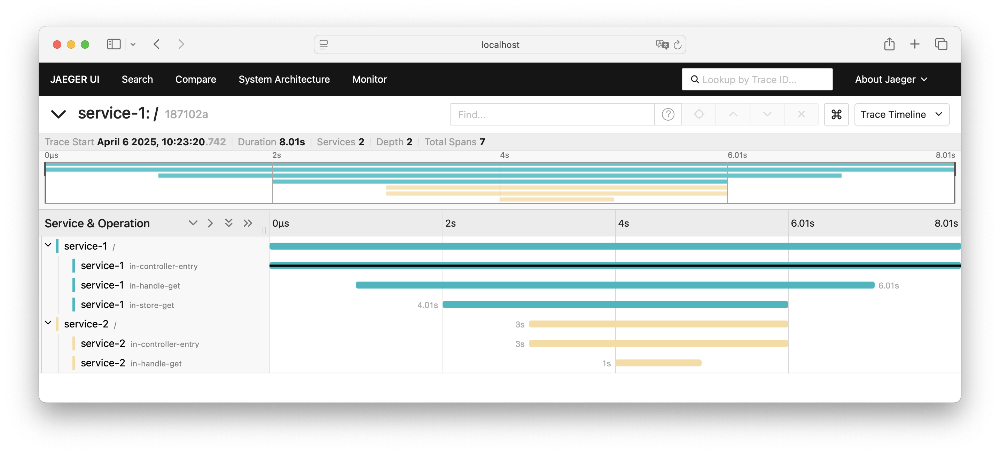

# Observability

This repository contains three examples:

1. How to use structured logging
1. How to expose and collect Prometheus metrics
1. How to use to manually instrument a service with tracing

## How to run

Run with:

```sh
    docker compose up -d
    make run
    curl -X GET "localhost:4040/?key=test"
    curl -X POST "localhost:4040/?key=test&value=test"
```

You can find the [jaeger UI here](http://localhost:16686/search).


